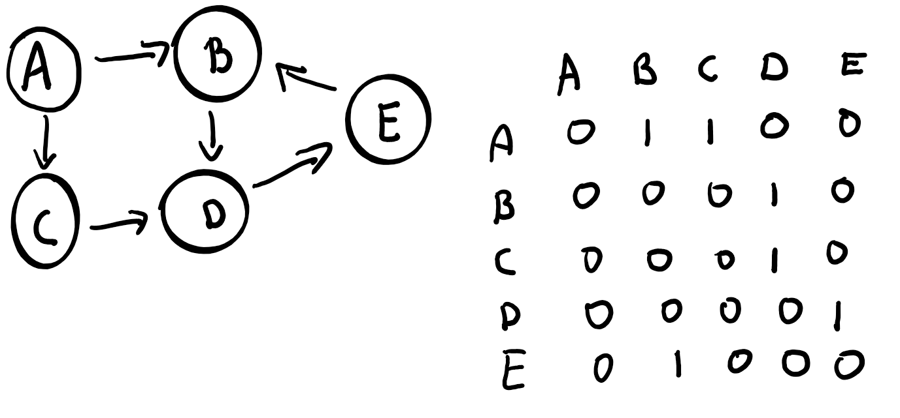

Create a communication topology from this adjacency matrix:

Then implement controlled flooding algorithm with sequence number.
The actor A will start the algorithm with sequence number 0.
If an actor receives a message with a sequence number, it stores it.
If the sequence number is already stored, it drops the message.